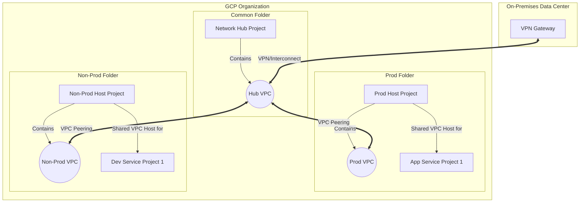

# GCP Landing Zone Architecture & Best Practices

This document defines the structural roles of folders, projects, and the CI/CD integration strategy.

## 1. Folder Structure & Roles

| Folder | Role | Key Contents |
| :--- | :--- | :--- |
| **Bootstrap** | **Control Plane.** Setup *before* anything else. | **Seed Project** (TF State, Service Accounts, WIF). |
| **Common** | **Shared Hub.** Connects everything. | **Network Hub Project** (Interconnects, VPNs), **Artifact Registry**, DNS Hub. |
| **Prod** | **Production Workloads.** | **Prod Host Project** (Prod VPC), **Service Projects** (GKE, Cloud SQL). |
| **Non-Prod** | **Dev/Staging Workloads.** | **Non-Prod Host Project** (Non-Prod VPC), **Service Projects** (Dev VMs). |

## 2. Network Strategy: Hub & Spoke + Shared VPC

To address your requirement for a "Common Network Hub" while handling the "Transitive Peering" limitation, we use a hybrid approach: **Hub-and-Spoke Peering** combined with **Shared VPC**.

### The Hierarchy

1.  **Network Hub (in `Common` folder)**:
    *   **Resource**: `hub-vpc`
    *   **Role**: The central router. Terminates VPNs or Interconnects from On-Prem.
    *   **Peering**: Peered with `prod-vpc` and `non-prod-vpc`.

2.  **Prod Host (in `Prod` folder)**:
    *   **Resource**: `prod-vpc`
    *   **Role**: The network for production. Peered with `hub-vpc`.
    *   **Shared VPC**: This project is a **Shared VPC Host**.
    *   **Service Projects**: All Production apps live in Service Projects *attached* to this Host. They see the `prod-vpc` directly.

3.  **Non-Prod Host (in `Non-Prod` folder)**:
    *   **Resource**: `non-prod-vpc`
    *   **Role**: The network for dev/test. Peered with `hub-vpc`.
    *   **Shared VPC**: This project is a **Shared VPC Host**.

### Why this works (Transitive Peering Solution)

GCP VPC Peering is non-transitive. If A peers with B, and B peers with C, A cannot talk to C.
*   **Hub** peers with **Prod Host** -> OK.
*   **Hub** peers with **Non-Prod Host** -> OK.
*   **Prod** cannot talk to **Non-Prod** directly (Good! Security isolation).

**But how do apps (Service Projects) talk to On-Prem via the Hub?**
Service Projects are **attached** to the Host (Shared VPC). They are effectively *inside* the Host's network.
*   App (in Service Project) -> lives in `prod-vpc`.
*   `prod-vpc` -> Peered to `hub-vpc`.
*   `hub-vpc` -> VPN to On-Prem.
*   **Result**: Traffic flows On-Prem <-> Hub <-> Prod. (Requires exporting custom routes over peering).

### Diagram

## 3. CI/CD Deployment Flow

1.  **Workload Identity**: GitHub Actions authenticates with the **Seed Project** (in Bootstrap).
2.  **Impersonation**: It impersonates the `terraform-runner` Service Account.
3.  **Cross-Project Deployment**:
    *   The `terraform-runner` SA has `roles/resourcemanager.folderAdmin` on the folders.
    *   It creates the Host Projects in `Prod`/`Non-Prod`.
    *   It creates the Service Projects and attaches them to the Shared VPCs.
